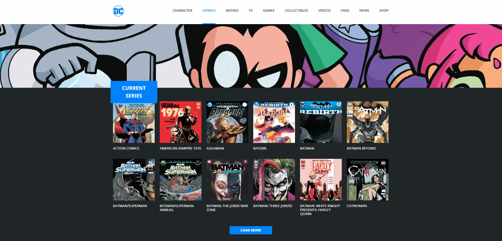

# DC Comics - React 

Una replica fedele dell'interfaccia web di **DC Comics**, realizzata per approfondire la logica della **componentizzazione** e la gestione dinamica dei dati in **React**.

Il progetto si concentra sulla scomposizione di un layout complesso in componenti atomici e riutilizzabili, simulando il flusso di dati di un'applicazione reale tramite l'uso delle props.

### Demo

### Tecnologie utilizzate

* **React**
* **Vite**
* **JavaScript**
* **CSS**